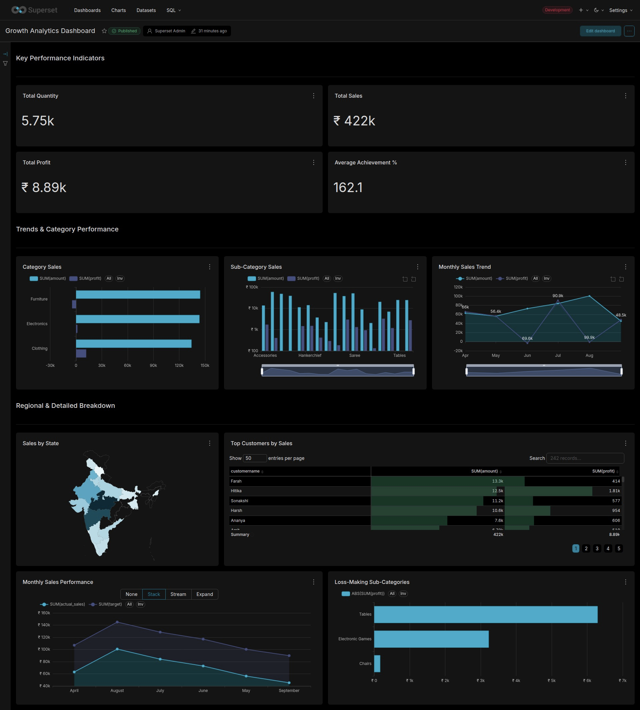
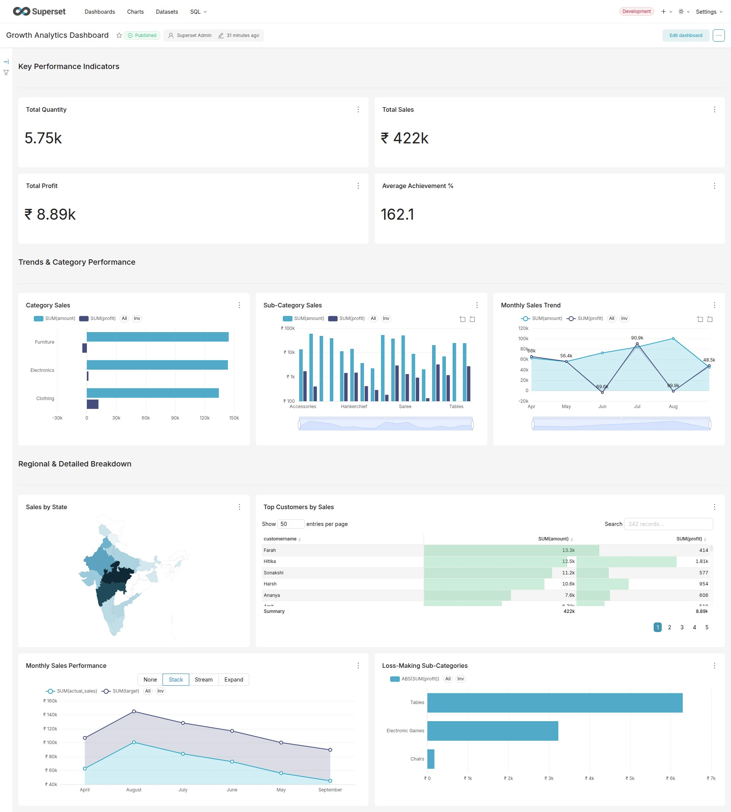
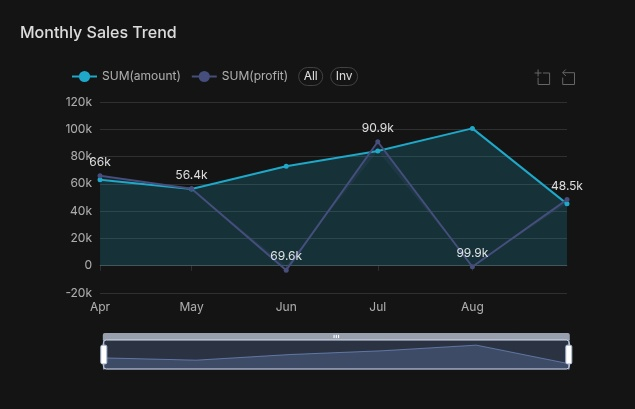
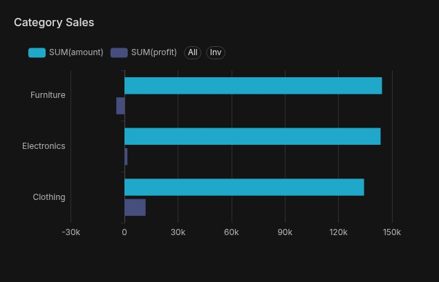
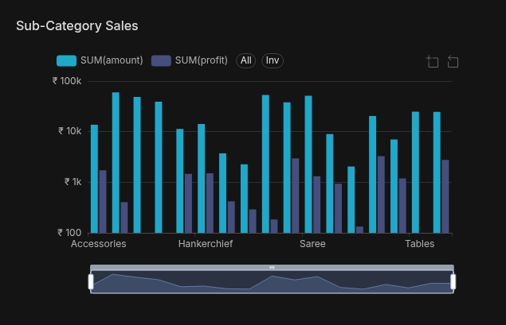
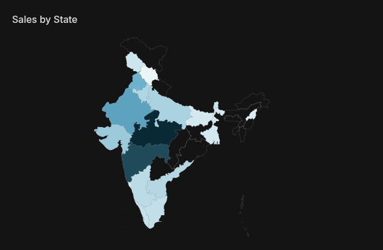
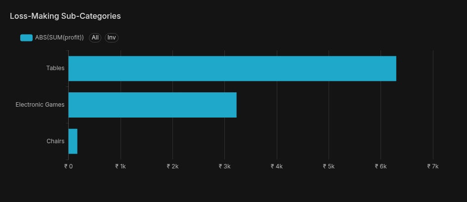
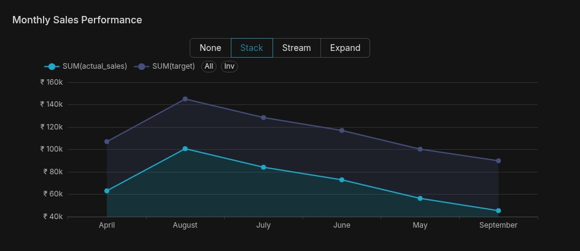

# Growth Analytics Dashboard

An interactive Business Intelligence dashboard built using **Apache Superset** and **MySQL** to analyze sales performance, customer behavior, regional trends, and business targets.

The project demonstrates a complete Business Intelligence workflow—from data cleaning and SQL analysis to dashboard development and interactive reporting.

---

# Dashboard Preview

## Dark Theme



## Light Theme



---

# Dashboard Demo

> **Watch the dashboard walkthrough**

[Dashboard Demo](dashboard/demo/demo.mp4)

---

# Features

- Interactive KPI Dashboard
- Sales Performance Analysis
- Profit Analysis
- Target vs Actual Sales Tracking
- Customer Performance Analysis
- Category & Sub-Category Analysis
- Geographic Sales Distribution
- Loss-Making Product Analysis

---

# Dashboard Components

| Visualization | Description |
|---------------|-------------|
| KPI Cards | Total Sales, Total Profit, Total Quantity & Average Achievement |
| Monthly Sales Trend | Monthly sales and profit trend |
| Category Sales | Sales comparison across categories |
| Sub-Category Sales | Product-level sales analysis |
| Sales by State | Geographic sales distribution |
| Top Customers | Highest revenue-generating customers |
| Loss-Making Sub-Categories | Products contributing to negative profit |
| Monthly Sales Performance | Target vs Actual Sales comparison |

---

# Dashboard Visuals

## Monthly Sales Trend



---

## Category Sales



---

## Sub-Category Sales



---

## Sales by State



---

## Loss-Making Sub-Categories



---

## Monthly Sales Performance



---

# Tech Stack

- Apache Superset
- MySQL
- SQL
- Python
- Pandas
- Matplotlib
- Jupyter Notebook

---

# Project Structure

```text
growth_analytics/

├── dashboard/
│   ├── charts/
│   │   ├── category-sales-2026-07-31T08-29-37.622Z.jpg
│   │   ├── loss-making-sub-categories-2026-07-31T08-29-55.992Z.jpg
│   │   ├── monthly-sales-performance-2026-07-31T08-29-53.363Z.jpg
│   │   ├── monthly-sales-trend-2026-07-31T08-29-43.046Z.jpg
│   │   ├── sales-by-state-2026-07-31T08-29-50.380Z.jpg
│   │   └── sub-category-sales-2026-07-31T08-29-40.543Z.jpg
│   │
│   ├── demo/
│   │   └── demo.mp4
│   │
│   └── imgs/
│       ├── dashboard-dark.png
│       └── dashboard-light.png
│
├── data/
│   ├── raw/
│   └── processed/
│
├── notebooks/
│   ├── data_processing.ipynb
│   ├── data_profiling.ipynb
│   └── DataQualitySummary.md
│
├── scripts/
│   ├── db_connector.py
│   ├── load_data.py
│   └── verify.py
│
├── sql/
│   ├── database_setup.sql
│   ├── analytical_views.sql
│   └── business_queries.sql
│
├── requirements.txt
├── README.md
└── .gitignore
```

---

# Business Questions Answered

- Which product categories generate the highest sales?
- Which sub-categories contribute to business losses?
- Which customers generate the highest revenue?
- Which states contribute the highest sales?
- How do monthly sales compare against predefined business targets?
- What are the monthly sales and profit trends?

---

# Skills Demonstrated

- Business Intelligence
- Dashboard Development
- SQL Analytics
- Data Visualization
- KPI Reporting
- Data Cleaning
- Data Preparation
- Apache Superset
- MySQL
- Python
- Pandas

---

# Setup

## 1. Clone the Repository

```bash
git clone https://github.com/<your-username>/growth_analytics.git
cd growth_analytics
```

## 2. Install Dependencies

```bash
pip install -r requirements.txt
```

## 3. Database Setup

Execute the SQL scripts in the following order:

1. `database_setup.sql`
2. `analytical_views.sql`
3. `business_queries.sql`

## 4. Launch Apache Superset

- Connect the MySQL database.
- Create datasets from the processed tables/views.
- Build or import the dashboard.
- Explore the interactive visualizations.

---

# License

This project is intended for educational and portfolio purposes.